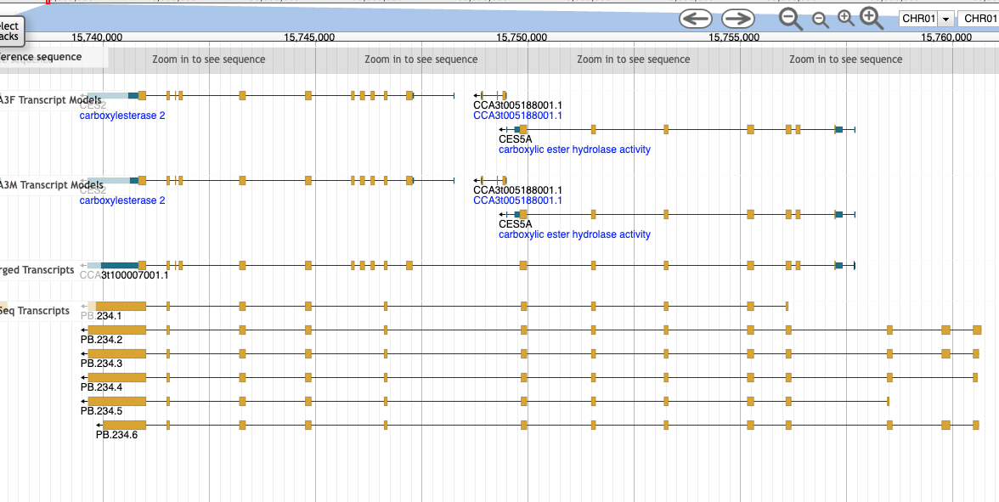
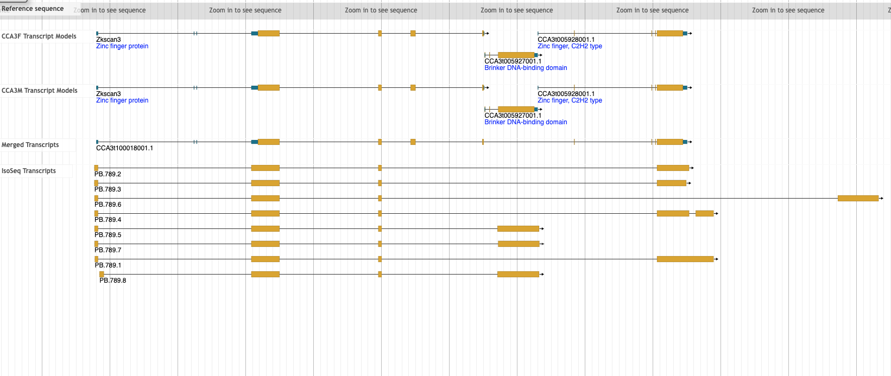

# Case Study: The `SKIPPED_GENE` Flag and `skip_flags`

## Runs compared

| Setting | `skip_flags` | `spanning_rescue` | `keep_msa` | run prefix |
|---------|-------------|-------------------|-----------|------------|
| **Base** | `SKIPPED_GENE,LOW_COV` | yes | no | `20260415_maxdist2_spanrescue_v2` |
| **Noskip** | `LOW_COV` only | no | yes | `20260416_noskip` |

The base run is the production configuration (`max_dist=4`, `spanning_rescue=yes`) from
the `max_dist`/`spanning_rescue` case study. The noskip run differs only in `skip_flags`:
`SKIPPED_GENE` candidates are no longer pre-filtered and proceed to MSA and translation
validation. `spanning_rescue` is disabled because it is redundant when SKIPPED_GENE
candidates pass through directly. `keep_msa = yes` was set to retain alignment files
for post-run inspection (see Part 2).

---

## Background: What Is a `SKIPPED_GENE` Candidate?

A merge candidate earns `SKIPPED_GENE` when the protein tiling graph shows that a
*third*, distinct gene also tiles onto the same reference protein between the two
candidate genes. In other words, the reference protein is covered by at least three
genomic gene models, and the middle one is not part of the proposed merge.

This pattern arises from two distinct biological scenarios that look identical in the
tiling graph:

**Scenario A — True split gene with a coincidental intervening gene:**
The locus is genuinely fragmented, but an unrelated gene (a tandem duplicate, a
domain-family member, or a gene with structural homology) happens to also tile the
same reference protein. The two flanking fragments are real split-gene pieces. The
intervening gene is a coincidence of reference protein choice.

**Scenario B — Independent paralogs misidentified as split fragments:**
Three separate genes all share sequence similarity to a multi-domain reference
protein. None of them are fragments of a single locus; each is a distinct gene. A
merge of any two would be wrong.

The default `skip_flags = SKIPPED_GENE,LOW_COV` acts as a conservative prior that
treats all SKIPPED_GENE candidates as Scenario B. This case study tests whether that
prior is justified, and when it should be relaxed.

---

# Part 1: Choosing Your `skip_flags` Setting

*For users running Mender for the first time, or deciding on parameters for a new genome.*

## The Empirical Finding

| Run | PASS | REVIEW | FAIL | Total validated |
|-----|------|--------|------|-----------------|
| Base (`spanning_rescue=yes`) | 1,011 | 36 | 0 | 1,047 |
| Noskip (`skip_flags=LOW_COV`) | 1,021 | 43 | 0 | 1,064 |
| **Difference** | **+10** | **+7** | **0** | **+17** |

Allowing SKIPPED_GENE candidates through validation recovers 17 additional merges
from the 42 SKIPPED_GENE candidates that the base run excludes (or rescues via
IsoSeq). Zero additional FAIL results — no premature stops, no frameshifts.

The source of the +17:

| Outcome | Base run | Noskip run | Net gain |
|---------|----------|------------|---------|
| PASS | 19 (via IsoSeq rescue) | 29 | +10 |
| REVIEW | 1 (via IsoSeq rescue) | 8 | +7 |
| FAIL | 0 | 0 | 0 |
| Silently excluded | 22 | 5 (LOW_COV only) | — |

The 10 additional PASS merges (no IsoSeq rescue) are validated entirely by protein
structure evidence: clean open reading frames with no internal stops, high junction
scores, and high reference coverage. The 7 additional REVIEW cases are discussed in
detail in Part 2.

## Why 0 FAIL?

A premature stop codon or frameshift in the merged protein would be immediate,
unambiguous evidence of a mis-merge — yet none of the 42 candidates produce one.
The most likely explanation:

The "skipped gene" is typically a tandem paralogue or domain-family member that
tiles onto the same reference protein as the flanking fragments, but it is a
genuinely separate locus. Its presence in the tiling graph does not invalidate the
merge of the flanking fragments — those fragments retain correct reading frames that
splice together cleanly at the exon junction.

**Important caveat:** 0 FAIL does not mean 0 wrong merges. The translation
validation step tests whether the merged CDS encodes an intact open reading frame.
It does not — and cannot — detect a merge of two complete, independently functional
paralogous genes, each of which happens to produce a valid protein individually.
Manual MSA inspection is required for those cases (see Part 2).

## PASS vs REVIEW: What Separates Them

The 8 REVIEW cases from SKIPPED_GENE candidates are not translation failures. Their
REVIEW status is driven by MSA junction scores below the `min_junction_score` threshold
or by coverage metrics that reflect biology rather than bad merges — specifically,
lineage-specific sequence insertions in the chameleon and partial fragments of very
large reference proteins. These are discussed case by case in Part 2.

## Reference-Invariance of SKIPPED_GENE Flags

From the reference comparison case study, all 42 SKIPPED_GENE candidates in the
Anolis run appear with `SKIPPED_GENE` status in the SwissProt run as well. Every
intervening gene at these loci has a conserved vertebrate ortholog with SwissProt
entries; none are squamate-specific novelties. No reference proteome choice will
remove a SKIPPED_GENE flag: the only routes to recovery are `spanning_rescue` with
IsoSeq data, or removing `SKIPPED_GENE` from `skip_flags`.

## Choosing a Setting

**Recommended default: `skip_flags = SKIPPED_GENE,LOW_COV`**

Keep `SKIPPED_GENE` in `skip_flags`. The noskip analysis above tells you what you
are conservatively setting aside: up to ~17 additional validated merges per run, of
which roughly 10 are clean PASSes and 8 require manual review — including two cases
(a serpin gene cluster and an immunoglobulin locus) that should be rejected. For
most production runs, the cost of manually reviewing those 8 cases outweighs the
gain of the 10 additional PASSes.

If you have IsoSeq data, pair the default `skip_flags` with `spanning_rescue = yes`
to recover SKIPPED_GENE candidates that have direct long-read support — the safest
possible route to including them.

If you want to recover all protein-valid SKIPPED_GENE merges and are willing to
do manual triage, set `skip_flags = LOW_COV` with `keep_msa = yes` and follow
the MSA review workflow in Part 2. Pay particular attention to expanded gene
families (serpins, keratins, immunoglobulins, zinc fingers) — these are the families
where SKIPPED_GENE merges are most likely to be wrong.

## Same-Family Skipped Genes: Manual Inspection

A subset of SKIPPED_GENE candidates have a skipped gene that hits the **same
reference protein family** as the merge cluster itself. In the CCA3 dataset, two
skipped genes at the ZNFX1 locus (merge_720) both have blast hits to ZNFX1-family
proteins. The main merged chain covers only ~37% of the 3326 aa human ZNFX1 —
suggesting the skipped genes may be additional split fragments of the same locus
that the chain algorithm could not link.

These cases cannot be resolved automatically: the skipped gene may be (a) an
additional fragment of the same split gene that warrants inclusion in the merge, or
(b) a paralogous family member at the same genomic location. Manual inspection is
required.

To identify same-family skipped genes in your run, examine the `skipped_genes`
column in `merge_candidates.txt` for each SKIPPED_GENE candidate, cross-reference
the blast hit of the skipped gene against the merge cluster's reference protein in
`diamond.out`, and inspect the genomic region in a browser. If the skipped gene
is a genuine additional fragment, it can be incorporated into the merge manually by
editing the source gene list before running step 9.

---

## Visual Examples: `spanning_rescue` in Practice

When `spanning_rescue = yes`, SKIPPED_GENE candidates with full-span IsoSeq support
bypass the skip filter and proceed to validation. In the CCA3 production run
(`chacal_20260416.cfg`, `skip_flags = SKIPPED_GENE,LOW_COV`, `spanning_rescue = yes`),
19 SKIPPED_GENE candidates were rescued. Their genomic coordinates are:

| merge | coords | strand |
|-------|--------|--------|
| merge_7 | CHR01:15739636..15757695 | − |
| merge_22 | CHR01:37472007..37493773 | + |
| merge_156 | CHR01:245672005..245748051 | + |
| merge_165 | CHR01:250399923..250435442 | + |
| merge_250 | CHR02:18203223..18395961 | + |
| merge_353 | CHR02:203662465..203728292 | − |
| merge_356 | CHR02:204924036..205355129 | − |
| merge_488 | CHR03:49808999..49850107 | + |
| merge_530 | CHR03:156748013..156829360 | + |
| merge_590 | CHR03:282497784..282770911 | − |
| merge_728 | CHR05X:4969587..5430590 | − |
| merge_797 | CHR05X:167386983..167450838 | − |
| merge_863 | CHR05Y:67138301..67196822 | − |
| merge_907 | CHR05Y:169350807..169410622 | − |
| merge_990 | CHR06:71576966..71696952 | + |
| merge_999 | CHR06:82280513..82313919 | − |
| merge_1083 | CHR09:5975677..6040809 | − |
| merge_1085 | CHR09:15532959..15554525 | − |
| merge_1113 | CHR12:9175260..9211074 | + |

Manual inspection reveals that rescue quality varies substantially. Two contrasting
examples illustrate the range of outcomes.

### Example 1 — Clean rescue (merge_7, CHR01:15739636..15757695)



**Source annotation:** two carboxylesterase fragments (`CCA3g005187000.1`,
`CCA3g005189000.1`) flanking a small unannotated gene (`CCA3g005188000.1`).
**IsoSeq evidence:** all 6 PB.234 reads span the full locus without interruption.
**Verdict:** the skipped gene has no functional annotation and is likely a spurious
internal model. The IsoSeq data unambiguously supports a single continuous transcript.
This rescue is correct.

### Example 2 — Questionable rescue (merge_22, CHR01:37472007..37493773)



**Source annotation:** `Zkscan3` / Zinc finger protein flanking a skipped gene
annotated as **Brinker DNA-binding domain** (`CCA3t005927001.1`), with a second
zinc finger C2H2-type gene (`CCA3t005928001.1`) as the right merge partner.
**IsoSeq evidence:** mixed — PB.789.2, .3, .6, .1 span the full locus, but
PB.789.5, .7, .8 terminate mid-locus near the skipped gene and never reach the
right zinc finger fragment.
**Verdict:** this is a zinc finger gene cluster. Tandem zinc finger arrays
are prone to IsoSeq read-through that mimics co-transcription. The skipped gene
has a domain annotation (Brinker DNA-binding domain), the IsoSeq support is
partial, and the biological prior for independent tandem zinc finger genes is
strong. This rescue is suspect and warrants manual review before acceptance.

### Recommendation

These examples illustrate why `spanning_rescue` requires IsoSeq data of sufficient
quality and why the rescued set should be spot-checked in a genome browser,
especially at gene families known to produce tandem arrays (zinc fingers, serpins,
keratins, immunoglobulins). For conservative genome annotation where false merges
are more costly than missed merges, setting `spanning_rescue = no` is the safer
choice: it drops all 19 rescued candidates but eliminates the risk of cases like
merge_22 entering the final annotation.

---

# Part 2: Reviewing Your Results — Triaging REVIEW Calls from SKIPPED_GENE Merges

*For users who have run Mender with `skip_flags = LOW_COV` and are looking at their
`report.tsv` to decide what to do with REVIEW calls.*

**Required:** `keep_msa = yes` must have been set so that alignment files are
available in `mender_workdir/transl_msa/`. Without MSA files, triage is limited to
report.tsv metrics only.

## What Puts a SKIPPED_GENE Merge into REVIEW?

REVIEW for SKIPPED_GENE candidates is **never** triggered by a broken protein. It is
triggered by one or more of:

1. `min_junction_score` below `min_junction_score` threshold (default 0.70)
2. `merged_cov_by_ref` below `min_merged_cov` threshold (default 0.60)
3. Secondary flags: `WEAK_END`, `WEAK_INTERNAL`, `TRANSITIVE_JOIN`, `SINGLE_HIT`

The first thing to check is **why** coverage or junction scores are low. Three
distinct causes produce very different verdicts:

| Cause | What you see in report.tsv | What you see in MSA | Verdict |
|-------|---------------------------|---------------------|---------|
| Lineage-specific insertion in merged protein | `merged_cov_by_ref` low; `ref_cov_by_merged` high; good junction scores | Source genes cover distinct non-overlapping regions of the reference; large aligned-gap block in reference rows | Likely correct merge; REVIEW is artifact |
| Partial fragment of very large reference protein | `ref_cov_by_merged` low; `merged_cov_by_ref` high; good junction scores | Source genes cover non-overlapping regions; reference rows have many trailing gaps | Correct merge; REVIEW reflects that only part of the gene is repaired here |
| Paralogous genes or complex gene family | `merged_cov_by_ref` low; each source gene independently covers the full reference | Each source gene spans the full reference alignment from N to C; internal alignment has duplicated blocks | Wrong merge; REVIEW is correct |
| Genuinely weak junction | `min_junction_score` low regardless of coverage; `WEAK_END` or `WEAK_INTERNAL` flag | Source genes cover non-overlapping regions but alignment at the junction gap is sparse or poorly conserved | Ambiguous; requires manual inspection |

## The Single Most Useful Diagnostic

Open the `_aligned.fa` file for the merge. Ask one question:

**Does each source gene independently span the full reference from N-terminus to
C-terminus?**

If yes → the source genes are paralogs or independent domain copies. The merge is
wrong regardless of translation metrics.

If no → the source genes cover distinct non-overlapping portions of the reference.
They are split fragments. Look at junction scores and coverage metrics to assess
confidence.

## The CCA3 REVIEW Cases: A Worked Triage

The 8 REVIEW cases from the CCA3 noskip run illustrate every category above.

### Category A: Correct merges — REVIEW is an artifact

**merge_569 — FARP2 (Rho GEF family)**

| metric | value |
|---|---|
| source_flags | `SKIPPED_GENE,STRONG` |
| merged_cov_by_ref | 0.559 |
| ref_cov_by_merged | 0.865 |
| min_junction_score | 0.700 |
| merged_protein_len | 2227 aa |

MSA: The three source genes cover three distinct, non-overlapping thirds of FARP2:

| Source gene | Region |
|---|---|
| CCA3g015650000.1 | N-terminal FERM domain |
| CCA3g015649000.1 | Central DRHM/linker region |
| CCA3g015647000.1 | C-terminal RhoGEF + PH domains |

FARP2_MOUSE is ~1380 aa; the chameleon merged protein is 2227 aa. A ~850 aa
lineage-specific insertion in the central region of the chameleon FARP2 produces a
large block of gaps in all reference rows mid-alignment. This inflates the merged
protein length relative to the reference, pushing `merged_cov_by_ref` below the 0.60
threshold. `ref_cov_by_merged = 0.865` — 86.5% of the reference is represented —
confirms the core FARP2 domain structure is intact. This is a genuine three-way
split of FARP2. **Verdict: accept.**

**merge_475 — MMP27 family (matrix metalloproteinase)**

| metric | value |
|---|---|
| source_flags | `SKIPPED_GENE` |
| merged_cov_by_ref | 0.590 |
| ref_cov_by_merged | 0.935 |
| min_junction_score | 0.700 |

MSA: CCA3g013916000.1 covers the N-terminal signal peptide, propeptide, and
catalytic domain. CCA3g013913000.1 covers the C-terminal hemopexin-like domain
repeats. These are non-overlapping. `merged_cov_by_ref = 0.59` is one percentage
point below the default threshold. **Verdict: accept; borderline threshold case.**

**merge_574 — NMNA3 (NMN adenylyltransferase)**

| metric | value |
|---|---|
| source_flags | `SKIPPED_GENE,SINGLE_HIT` |
| merged_cov_by_ref | 0.356 |
| ref_cov_by_merged | 1.000 |
| min_junction_score | 0.873 |

MSA: CCA3g015689000.1 contains a large N-terminal domain extension (~200 aa) with
no SwissProt match, followed by the NMN adenylyltransferase catalytic domain.
CCA3g015687000.1 covers only the C-terminal portion of the catalytic domain. The
NMNA3_HUMAN reference (~290 aa) covers only the adenylyltransferase domain, not the
N-terminal extension. `merged_cov_by_ref = 0.356` reflects the N-terminal extension
inflating the denominator; `ref_cov_by_merged = 1.000` shows the reference domain
is fully represented. Junction score 0.873 is clean. **Verdict: accept; the N-terminal
extension is a chameleon-specific domain not present in the SwissProt reference.**

**merge_720 — ZNFX1 (zinc finger NFX1-type)**

| metric | value |
|---|---|
| source_flags | `SKIPPED_GENE,SINGLE_HIT` |
| merged_cov_by_ref | 0.563 |
| ref_cov_by_merged | 0.426 |
| min_junction_score | 0.818 |

MSA: CCA3g018655000.1 covers the N-terminal portion; CCA3g018658000.1 covers a
C-terminal fragment. Non-overlapping, clean junction at 0.818. ZNFX1 is 3326 aa in
human; the merged chameleon fragment is 1231 aa, covering ~37% of the full gene.
`ref_cov_by_merged = 0.426` is low because this is only one portion of a very large
gene — the remaining ~2000 aa of ZNFX1 are presumably additional split fragments not
yet detected or annotated. **Verdict: accept this fragment merge; note that more
fragments of ZNFX1 may exist elsewhere in the annotation.**

**merge_803 — FRAS1 (Fraser syndrome protein)**

| metric | value |
|---|---|
| source_flags | `SKIPPED_GENE,WEAK_END` |
| merged_cov_by_ref | 0.977 |
| ref_cov_by_merged | 0.360 |
| min_junction_score | 0.723 |

MSA: CCA3g001735000.1 covers the N-terminal Calx-beta/EGF-like domain repeats;
CCA3g001733000.1 covers the C-terminal EMILIN-like and laminin G domains. Non-
overlapping. FRAS1 is ~4000 aa in human; merged fragment is 1437 aa (36% of
reference). `merged_cov_by_ref = 0.977` — within the fragment, reference coverage
is excellent. `WEAK_END` flag and junction score of 0.723 indicate the terminal exon
boundary has suboptimal alignment. **Verdict: probably accept, but the WEAK_END
junction warrants checking in a genome browser before finalising.**

### Category B: Ambiguous — requires domain expertise

**merge_128 — Type II keratin (K2C75/K2C6A family)**

| metric | value |
|---|---|
| source_flags | `SKIPPED_GENE,WEAK_END` |
| merged_cov_by_ref | 0.471 |
| ref_cov_by_merged | 0.766 |
| min_junction_score | 0.700 |

MSA: Three source genes cover distinct regions — head domain (CCA3g007795), Gly/
Tyr-rich central repeat region (CCA3g007792), and tail domain (CCA3g007791). Non-
overlapping. The WEAK_END flag fires at the junction with the Gly/Tyr-rich repeat
(CCA3g007792), which is inherently poorly conserved in mammalian references because
squamate keratins have a structurally diverged tail domain.

The chameleon has an expanded suite of hard (beta) keratins with domain organization
distinct from mammalian type II keratins. The low `merged_cov_by_ref = 0.471`
reflects genuine structural divergence, not a wrong merge. However, correctly
interpreting this case requires familiarity with squamate keratin biology.
**Verdict: likely real, but inspect the genome region. If the Gly/Tyr repeat
block (CCA3g007792) is flanked by the head and tail genes on the same chromosome
strand with no other open reading frames between them, accept.**

### Category C: REVIEW is correct — problematic merges

**merge_255 — SERPINA family (alpha-1-antitrypsin / alpha-2-antiplasmin family)**

| metric | value |
|---|---|
| source_flags | `SKIPPED_GENE,TRANSITIVE_JOIN,WEAK_END,WEAK_INTERNAL` |
| merged_cov_by_ref | 0.408 |
| ref_cov_by_merged | 0.998 |
| min_junction_score | 0.657 |
| merged_protein_len | 1421 aa |

MSA: This is the clearest example in the CCA3 dataset of the SKIPPED_GENE filter's
conservative prior being biologically correct.

CCA3g010107000.1 and CCA3g010108000.1 each independently span the **complete**
reference serpin alignment from N-terminus to C-terminus. A reference SERPINA protein
is ~400 aa; the merged protein is 1421 aa — consistent with approximately 3.5 complete
serpins chained together. The two main source genes are not split fragments of a
single locus; they are two distinct, complete SERPINA paralogues. CCA3g010110 and
CCA3g010112 add two more C-terminal fragments of additional serpins in the cluster.

The `TRANSITIVE_JOIN,WEAK_END,WEAK_INTERNAL` flag combination is a strong signal that
the chain is being assembled across multiple independent loci rather than genuine
split fragments. The accumulation of multiple junction quality warnings alongside each
source gene independently covering the full reference is decisive.

The chameleon likely has a SERPINA gene cluster analogous to the alpha-1-antitrypsin
cluster in humans (SERPINA1 through SERPINA13 on 14q32). These genes share ~40–50%
identity, which is enough for adjacent paralogs to tile the same reference. They are
not a split gene.

**Verdict: reject. Do not include merge_255 in the final annotation.**

**merge_935 — Immunoglobulin lambda light chain locus**

| metric | value |
|---|---|
| source_flags | `SKIPPED_GENE` |
| merged_cov_by_ref | 0.449 |
| ref_cov_by_merged | 0.866 |
| min_junction_score | 0.646 |
| merged_protein_len | 488 aa |

MSA: CCA3g004582000.1 contains a V+J rearrangement segment (variable + joining
regions). CCA3g004584000.1 appears to encode a second V+J segment followed by two
constant domains — essentially two complete V-J-C units within a single source gene.
The merged protein consequently contains what appear to be two V-J-C units in tandem.

The minimum junction score of 0.646 is the lowest of all 8 REVIEW cases. The
immunoglobulin lambda locus is a tandem array of V, J, and C gene segments that
undergo somatic recombination in B cells. Germline genome assemblies represent the
pre-recombination locus with multiple copies of each segment type. Merging across
these segments is not correcting a split gene — it is fusing what are legitimately
separate germline gene segments.

**Verdict: reject. Immunoglobulin and T-cell receptor loci should be excluded from
Mender runs entirely, or handled with a gene-list exclusion. Consider adding the
relevant chromosome region to an exclusion list for future runs.**

---

## Summary Triage Decision Tree

When you see a SKIPPED_GENE merge in REVIEW status:

```
1. Open the _aligned.fa file for the merge.
2. Does each source gene independently span the full reference
   from N to C terminus?
   │
   ├─ YES → Wrong merge (paralogues or gene cluster). REJECT.
   │         Check for: multiple complete copies, internal
   │         alignment duplications, Ig/TCR loci.
   │
   └─ NO  → Source genes cover non-overlapping regions. Split gene.
             │
             ├─ Is merged_cov_by_ref low but ref_cov_by_merged high?
             │   → Lineage-specific insertion or partial fragment.
             │     Check junction scores. If ≥ 0.75, likely ACCEPT.
             │
             ├─ Is ref_cov_by_merged low (< 0.50)?
             │   → Partial fragment of a very large gene (e.g. FRAS1,
             │     ZNFX1). Merge is real but only part of gene is fixed.
             │     Check junction scores. ACCEPT with note.
             │
             └─ Is WEAK_END or WEAK_INTERNAL flagged?
                 → Inspect the specific junction in the MSA.
                   If the junction gap aligns cleanly in the MSA
                   despite the score, inspect in genome browser.
```

## Enabling MSA Output

To run the triage above you must have alignment files. Set `keep_msa = yes` in your
config. Files are written to `mender_workdir/transl_msa/<merge_id>_aligned.fa`.

If you ran without `keep_msa`, re-run step 8 only (adding `--steps 8`) with
`keep_msa = yes`. Step 8 does not modify the GFF; it is safe to re-run in place.

```ini
# Re-run step 8 with MSA output
keep_msa = yes
```

```bash
perl run_mender.pl --config your.cfg --steps 8
```

The MSA files for REVIEW cases will then be available for inspection.

---

## Practical Recommendations

**Default setting:** `skip_flags = SKIPPED_GENE,LOW_COV`. This is the recommended
production setting. SKIPPED_GENE candidates are flagged in `report.tsv` so you can
see what is being held back, but they are not included in the merged output.

**With IsoSeq:** Add `spanning_rescue = yes`. This recovers SKIPPED_GENE candidates
that have direct full-span long-read support — the most conservative route to
including them.

**Manual follow-up for same-family skipped genes:** After your run, review the
`skipped_genes` column in `merge_candidates.txt` for candidates where the skipped
gene's blast hit (in `diamond.out`) matches the same protein family as the merge
cluster. These cases may represent additional split fragments of the same locus and
are worth manual inspection. If you confirm a same-family skipped gene is a genuine
additional fragment, it can be incorporated into the merge by editing the source
gene list before step 9.

**Genes to watch:** Immunoglobulin/TCR loci and expanded gene families with ≥ 40%
within-family identity (serpins, keratins, Hsp70s, metalloproteases, zinc fingers)
are the families most likely to produce spurious SKIPPED_GENE chains. The CCA3
serpin cluster (merge_255) and Ig lambda locus (merge_935) are examples where the
SKIPPED_GENE filter correctly prevented wrong merges.

---

# Methods: Reproducing the Comparison Analysis

All commands assume you are in the mender working directory. The base run uses
`results/20260415_maxdist2_spanrescue_v2/` and the noskip run uses
`results/20260416_noskip/`. The merge candidate tables from the detection steps
(shared between runs of the same `max_dist`) are in
`results/20260414/work/merge_candidates.txt`. Adjust run prefix paths to match
your own runs.

## 1. Compare PASS/REVIEW/FAIL totals between runs

Column 20 of `report.tsv` holds the overall validation result.

```bash
echo "=== Base run ==="
awk -F'\t' 'NR>1 {print $20}' \
  results/20260415_maxdist2_spanrescue_v2/report.tsv | sort | uniq -c

echo "=== Noskip run ==="
awk -F'\t' 'NR>1 {print $20}' \
  results/20260416_noskip/report.tsv | sort | uniq -c
```

## 2. Identify SKIPPED_GENE candidates

Column 17 of `merge_candidates.txt` holds the flag field. Extract all candidates
carrying `SKIPPED_GENE` but not `LOW_COV` (these are the ones the base run
silently excludes and the noskip run allows through).

```bash
# All SKIPPED_GENE flag combinations
awk -F'\t' 'NR>1 && $17~/SKIPPED_GENE/ {print $17}' \
  results/20260414/work/merge_candidates.txt | sort | uniq -c | sort -rn

# Non-LOW_COV SKIPPED_GENE candidates only
awk -F'\t' 'NR>1 && $17~/SKIPPED_GENE/ && $17!~/LOW_COV/ {print $3}' \
  results/20260414/work/merge_candidates.txt | sort > /tmp/skipped_gene_cands.txt

wc -l /tmp/skipped_gene_cands.txt
```

## 3. Outcomes of SKIPPED_GENE candidates in each run

Cross-reference the candidate source-gene lists against each run's report.tsv.
Column 3 of `report.tsv` is `source_genes`; column 20 is `overall_result`.

```bash
# Noskip run outcomes for SKIPPED_GENE candidates
awk -F'\t' 'NR>1 {print $3,$20}' OFS='\t' \
  results/20260416_noskip/report.tsv \
  | grep -Ff /tmp/skipped_gene_cands.txt \
  | awk -F'\t' '{print $2}' | sort | uniq -c

# Base run outcomes (IsoSeq-rescued SKIPPED_GENE only)
# source_flags (col 18) will contain SKIPPED_GENE for rescued candidates
awk -F'\t' 'NR>1 && $18~/SKIPPED_GENE/ {print $3,$20}' OFS='\t' \
  results/20260415_maxdist2_spanrescue_v2/report.tsv \
  | awk -F'\t' '{print $2}' | sort | uniq -c
```

## 4. Classify blast hits for skipped (intervening) genes

Column 14 of `merge_candidates.txt` is `skipped_genes` — a comma-separated list
of gene IDs that sit genomically between the chain members. Column 7 is
`best_hit` — the reference protein for the merge cluster.

The blast results for each gene's transcript are in `mender_workdir/diamond.out`
(columns: query=CCA3t..., subject=ENSACAP..., pident, length, ...).

To classify each skipped gene's blast profile against its cluster's reference:

```bash
# Step 1: extract unique skipped gene IDs from non-LOW_COV SKIPPED_GENE candidates
awk -F'\t' 'NR>1 && $17~/SKIPPED_GENE/ && $17!~/LOW_COV/ && $14!="none" {print $14}' \
  results/20260414/work/merge_candidates.txt \
  | tr ',' '\n' | sort -u > /tmp/skipped_gene_ids.txt

# Step 2: find best blast hit for each skipped gene's transcript(s)
# Gene IDs are CCA3g...; transcript IDs are CCA3t... — convert gene->transcript prefix
sed 's/CCA3g/CCA3t/' /tmp/skipped_gene_ids.txt > /tmp/skipped_trans_prefix.txt

grep -Ff /tmp/skipped_trans_prefix.txt mender_workdir/diamond.out \
  | sort -k1,1 -k12,12rn \
  | awk '!seen[$1]++' \
  > /tmp/skipped_gene_blast_hits.txt

# Step 3: compare each skipped gene's top hit to its cluster's reference (col 7)
# For each SKIPPED_GENE candidate, extract: merge_id, cluster_ref, skipped_gene_ids
awk -F'\t' 'NR>1 && $17~/SKIPPED_GENE/ && $17!~/LOW_COV/ && $14!="none" \
  {print $1, $7, $14}' OFS='\t' \
  results/20260414/work/merge_candidates.txt
# Then manually cross-reference skipped gene blast hits to classify as:
#   NO_HIT    — no diamond.out entry for the gene's transcript(s)
#   SAME_REF  — top hit matches the cluster's best_hit subject
#   DIFF_REF  — top hit is a different subject
```

## 5. Count exons per skipped gene

Exon features in the GFF have `Parent=` pointing to mRNA IDs (CCA3t...), not
gene IDs. A two-step approach is required: first find mRNA IDs for the gene,
then count exons under those mRNAs.

```bash
GFF=/path/to/CCA3-ref.merged.06192025.slim.gff

while read gene; do
  gene_base="${gene%.1}"
  # Step 1: find mRNA IDs for this gene
  mrna_ids=$(awk -v g="$gene_base" '$9~/Parent=/ && $9~g {
    match($9, /ID=([^;]+)/, a); print a[1]
  }' "$GFF" | grep "^CCA3t")
  # Step 2: count exon features under those mRNAs
  n_exons=0
  for mrna in $mrna_ids; do
    c=$(awk -v m="$mrna" '$3=="exon" && $9~/Parent=/ && $9~m' "$GFF" | wc -l)
    n_exons=$((n_exons + c))
  done
  echo -e "$gene\t$n_exons"
done < /tmp/skipped_gene_ids.txt
```

## 6. Identify same-family skipped genes

To find SKIPPED_GENE candidates where the intervening gene hits the same
reference protein family as the merge cluster, cross-reference the blast output
from step 4 with the cluster's `best_hit` (column 7 of `merge_candidates.txt`).

```bash
# For each candidate: print merge_id, cluster_ref, skipped_gene, skipped_gene_top_hit
awk -F'\t' 'NR>1 && $17~/SKIPPED_GENE/ && $17!~/LOW_COV/ && $14!="none"' \
  results/20260414/work/merge_candidates.txt \
  | while IFS=$'\t' read -r merge_id n genes coords ref descs best_hit hit_desc \
      cov gap eval junc_hits junc_dist skipped_genes max_tiling npairs flag; do
    for sg in $(echo "$skipped_genes" | tr ',' ' '); do
      sg_trans="${sg/CCA3g/CCA3t}"
      sg_hit=$(awk -v t="$sg_trans" '$1==t {print $2; exit}' \
               /tmp/skipped_gene_blast_hits.txt)
      echo -e "$merge_id\t$best_hit\t$sg\t${sg_hit:-NO_HIT}"
    done
  done | awk -F'\t' '$2==$4 {print "SAME_REF:", $0} $2!=$4 && $4!="NO_HIT" \
    {print "DIFF_REF:", $0} $4=="NO_HIT" {print "NO_HIT:", $0}'
```
