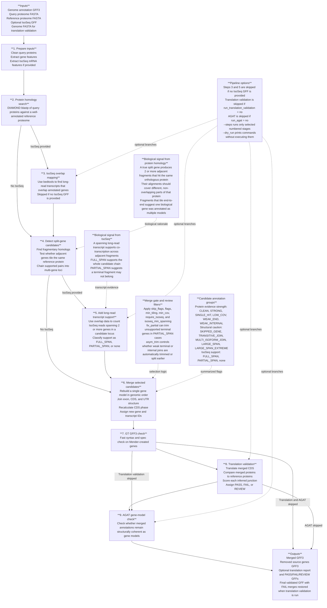

# Mender pipeline diagram draft

This is a standalone draft so the structure can be reviewed before deciding
whether to embed it in `README.md`.

## Design notes

- The main vertical flow shows the executable pipeline in `run_mender.pl`.
- The right-hand callouts separate **biology**, **filters**, and **options** so
  the core process is still readable.
- Flags are grouped by meaning rather than shown as many separate arrows.

## If this moves into the README

- Best placement: just before `## Pipeline Steps`.
- If it feels too dense there, split it into:
  1. one main pipeline flow
  2. one smaller biological evidence panel
  3. one compact options and flags legend
